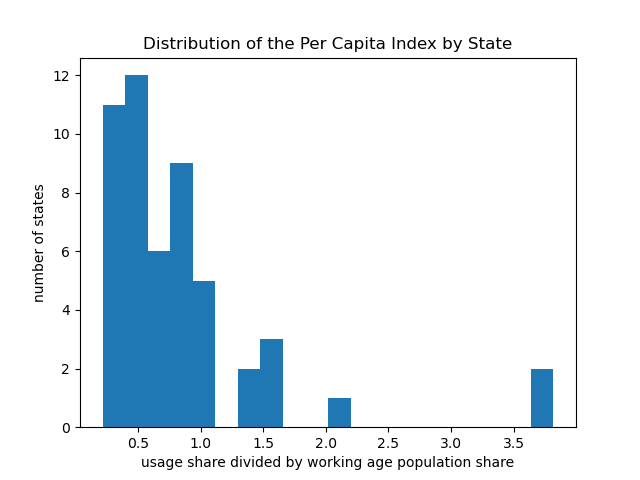
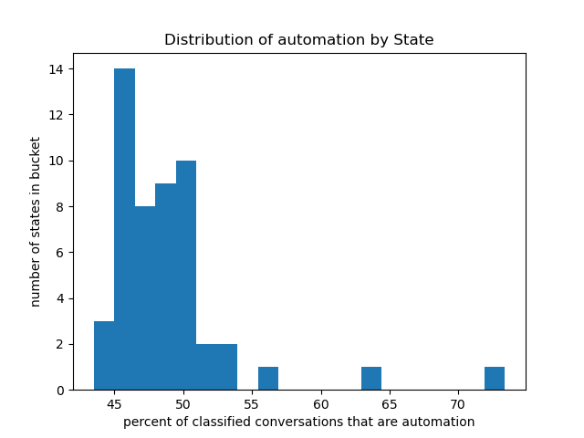
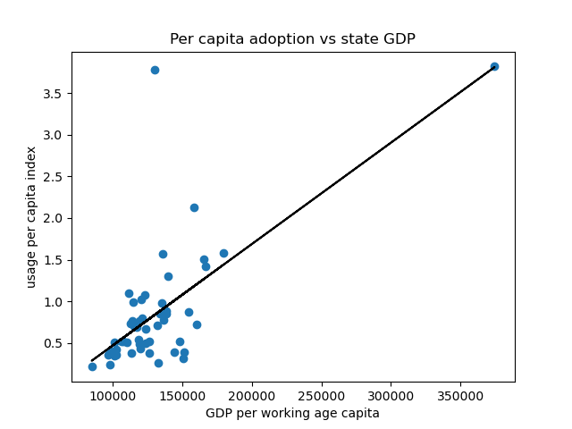
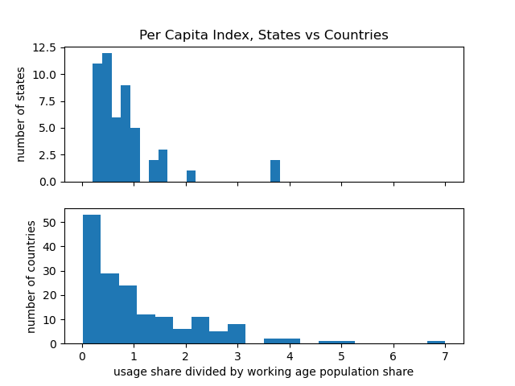

# Profile.md

All figures and numbers were calculated using the v3 enriched file, covering August 4-11 of 2025. Figures and numbers are calculated in exploratory_analysis.py

I am using research Q2: What explains geographic differences in AI adoption. We have two main factors here included within v3 that should provide some insight: per capita index and the automation share. Both are defined to the state level, and are added during enrichment meaning derived attributes that are not present in other versions, so initial exploration will decide if exploring these factors in other releases would be a good idea.

## Per Capita Adoption

This index is a state's share of US usage divided by the states share of the working age population. This is described as AUI and is an Anthropic metric. A baseline is 1.0 meaning a state would be using the amount of Claude we would expect, anything above means more than expected and vice versa. The distribution above is right skewed, with most states sitting below the 1.0 threshold and a few sitting far above 1.0. DC sits at 3.82 and Utah sits at 3.78 far above the rest of the states. 

| highest | index |
| --- | --- |
| DC | 3.82 |
| UT | 3.78 |
| CA | 2.13 |
| NY | 1.58 |
| VA | 1.57 |

| lowest | index |
| --- | --- |
| MS | 0.21 |
| WV | 0.23 |
| SD | 0.26 |
| AK | 0.31 |
| KY | 0.35 |

These values written above match those found in v3's report.

## Automation Share

This is the share of a state's classified collaboration that leans towards automation vs augmentation. The spread is much tighter than Adoption, many states are hovering around 50% with 2 distinct outliers:UT and SD .

| highest automation | share |
| --- | --- |
| UT | 73.4 |
| SD | 63.5 |
| ND | 56.0 |
| WY | 53.3 |

| highest augmentation | share |
| --- | --- |
| DC | 56.5 |
| VT | 56.4 |
| WA | 55.8 |
| NM | 55.0 |

Utah has the highest automation share 73.4%, with SD at 63.5%, this large percentage for Utah along with its abnormally high adoption rate makes it an interesting potential case study within the larger project. This is especially interesting when you consider DC which was the other large outlier in AUI has the highest augmentation share. V3's report flags Utah as possible automated traffic driven through that made it past their blockers so that is something to be aware of and it may be the reason its automation is so high, needs more substantiated evidence. 

| smallest samples | conversations |
| --- | --- |
| WY | 135 |
| AK | 139 |
| SD | 140 |
| ND | 183 | 

Above highlights that many of these state wide statistics need to be taken with a grain of salt since many states do not have a large sample to base off of, may highlight the need for a month long aggregation similar to the approach taken in release 6.

## Adoption against State GDP

GDP per working age capita is the only economic covariate already present in the initial download so provides some insight before joining the data externally. Across all states the correlation is 0.68 strong enough to show there is a relationship there.

As pointed out earlier we have 2 very strong AUI outliers in DC and Utah therefore the correlation without either state was considered. The correlation without DC is 0.42, and the correlation without Utah is 0.84 another indication that Utah is a very strong outlier.

## What is next based on the exploratory analysis 

Add in other economic/population data besides what currently resides such as occupation employment and wages, census industry mix etc. Research into Utah is this simply a coincidence based on one week of data is this a recurring thing across releases is there a reasonable explanation or is there something misleading happening. Handling sample sizes for small population and conversation states, a threshold of 100 conversation minimum is applied but breaking smaller states down to categories loses almost all information. Is 100 a reasonable minimum or should this be adjusted. 

## States or Countries

The same metrics exist at both state and country level.

| | states | countries |
| --- | --- | --- |
| geographies with usage | 51 | 172 |
| with a per capita index | 51 | 166 |
| with an automation share | 51 | 158 |
| median index | 0.70 | 0.73 |
| index range | 0.21 - 3.82 | 0.01 - 7.00 |
| median automation | 48.2 | 54.6 |
| automation middle half | 46.1 - 49.9 | 49.8 - 60.3 |
| median conversations | 1,811 | 583 |
| lower quartile conversations | 639 | 93 |
| index vs gdp | 0.68 | 0.75 |

| highest | index | conversations |
| --- | --- | --- |
| ISR | 7.00 | 10,941 |
| MCO | 4.93 | 25 |
| SGP | 4.57 | 5,375 |
| AUS | 4.10 | 18,753 |
| NZL | 4.05 | 3,647 |

| lowest | index | conversations |
| --- | --- | --- |
| TKM | 0.01 | 18 |
| NER | 0.02 | 71 |
| TCD | 0.02 | 67 |
| BDI | 0.03 | 59 |
| GIN | 0.04 | 77 |

Countries have a larger sample size and variation, roughly three times the observations with a much wider spread in adoption. The median country has 583 conversations against 1,811 for the median state and a quarter of countries sit under 93. Thin samples also break the automation measure, any mode under 15 conversations gets pooled into not_classified so a small country can be left with only its most common mode. The other tradeoff is outside data, the US has occupational and census data that is easy to join where countries would need World Bank equivalents. Going with countries for the larger sample and wider variation, the extremes look worth digging into as well. 

Numbers calculated in states_vs_countries.py, included small sample size countries on purpose since it is an important distinction from states and in favor of aggregating across releases. 

## Outside Data

Looking at World Bank Data and Github Data, a small exploratory analysis seeing what is available and how well it does in predicting adoption(correlations are spearman).

| variable | source | matched out of 172 | index | automation | conversations |
| --- | --- | --- | --- | --- | --- |
| developers_per_100k | github | 164 | 0.95 | -0.71 | 0.34 |
| gdp_per_capita | world bank | 165 | 0.87 | -0.65 | 0.18 |
| internet_pct | world bank | 164 | 0.74 | -0.65 | 0.27 |
| tertiary_enrollment | world bank | 142 | 0.74 | -0.76 | 0.46 |
| services_employment_pct | world bank | 153 | 0.74 | -0.59 | 0.20 |
| urban_pct | world bank | 165 | 0.58 | -0.47 | 0.25 |
| gini_index | world bank | 132 | -0.39 | 0.43 | -0.18 |
| population | world bank | 165 | -0.26 | -0.08 | 0.78 |

The developer correlation pops out at 0.95 ahead of GDP. Some of that is overlap between the 2 populations, but it does mean that developer work may represent a stronger connection that simply economic data.

A big takeaway is the automation column is all negative meaning everything that raises adoption also lowers automation which in turn should increase augmentation but could just increase unclassified, something to dig into further.

Population obviously correlates highly to conversations, but not to index and automation so population doesnt translate to how things are used.

Below are comparing countries developer base not population, only countries with more than 100 conversations are included here. A ratio above 1.0 is higher than would be expected and below 1 is lower than to be expected. This could mean more non-technical usage, something to explore further.

| most usage per developer | ratio | conversations |
| --- | --- | --- |
| ISR | 2.43 | 10,941 |
| KOR | 2.32 | 35,285 |
| MOZ | 2.18 | 453 |
| LAO | 2.15 | 381 |
| SEN | 1.99 | 828 |

| least | ratio | conversations |
| --- | --- | --- |
| UZB | 0.28 | 479 |
| BGD | 0.37 | 3,318 |
| MNG | 0.44 | 178 |
| KGZ | 0.51 | 276 |
| SGP | 0.54 | 5,375 |

Numbers from outside_sources_explore.py